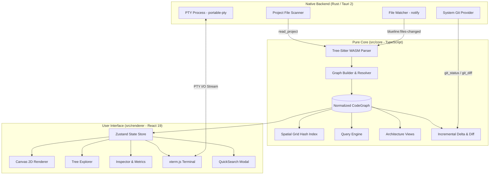

<div align="center">

# 🗺️ BlueLine

**See what your AI coding agent is actually changing.**

[](https://tauri.app/)
[](https://react.dev/)
[](https://www.typescriptlang.org/)
[](https://www.rust-lang.org/)
[](https://vitest.dev/)
[](LICENSE)

<br />

[Why?](#-why) •
[What is BlueLine?](#-what-is-blueline) •
[Features](#-features) •
[Architecture](#-architecture) •
[Commands & Shortcuts](#-commands--shortcuts) •
[Configuration](#-configuration-bluelinejson) •
[Installation](#-installation--usage) •
[Milestones M0–M13](#-implemented-milestones-m0m13) •
[Roadmap M14+](#-roadmap-m14)

</div>

---

## 💡 Why?

Working with **AI agents in the terminal** (Claude Code, Cursor CLI, Aider, Codex, or autonomous scripts) is incredibly fast. But also often **blind**.

An agent can create, move, and refactor dozens of files in seconds — leaving the developer with the cognitive burden of mentally reconstructing the system's architecture on every iteration.

The problem isn't just reviewing changed lines.

The real problem is reconstructing:

- which modules were affected
- which dependencies were created or removed
- which parts of the architecture changed
- what the blast radius was
- whether coupling increased
- which parts of the system now depend on the change

**BlueLine shows you the architectural impact of what your agent just did.**

---

## 🔍 What is BlueLine?

BlueLine is a **desktop architectural observability tool** for AI-assisted development.

It is **not** an agent, not a chat, not an editor.

It watches the same repository your agent is working on, detects changes in real time via native file watcher, and displays a **live architectural map** — modules, classes, methods, functions, and the dependencies between them.

| ✅ It is | ❌ It is not |
|---|---|
| **Live Structural Visualization** (modules, classes, methods, call/import edges) | An AI agent, chatbot, or prompt wrapper |
| **Architectural Review Platform** for real-time change understanding | A full IDE for writing code from scratch |
| **Real PTY Terminal** where you run your favorite AI agent or shell | A fake or decorative embedded terminal |
| **Semantic Zoom & Architectural Views** with spatial stability | A linter, formatter, or synthetic code generator |
| **Passive Deterministic Context Export** for pasting into prompts | A system that talks to LLMs or makes autonomous decisions |
| **Deterministic Navigation Bus** with auditable history | A generic graph visualizer with disorganized nodes |

---

## ✨ Features

### 🔍 1. Semantic Zoom — 5 Levels
Instead of infinite scroll that just rescales boxes, BlueLine switches the **semantic representation** at each abstraction level via explicit actions (double-click / `goto` command / `up`):

```
[ Level 1: System ] ──> Module/Layer blocks & global coupling
        │
[ Level 2: Module ]  ──> Classes, functions & files, import relations
        │
[ Level 3: Class ]   ──> Methods, members & call graph
        │
[ Level 4: Method ]  ──> Source inspection, signature & scope
        │
[ Level 5: Local ]   ──> Nested functions / closures & internal flow
```

### 👓 2. Architectural Views (Without Losing Spatial Position)


Views recolor and regroup the graph **without moving nodes**, preserving your spatial memory:
- 🏢 **Layers**: Visualizes `domain`, `infra`, `ui`, `application`, `shared`, `entrypoint`.
- 🌐 **Domain**: Groups symbols by business contexts configured in `blueline.json`.
- 🔗 **Coupling**: Highlights central nodes and calculates afferent/efferent dependency metrics.

### ⚡ 3. Live Updates & Real-Time Observation
- **Native Rust File Watcher (`notify`)**: Detects disk changes with intelligent debounce (150ms).
- **Incremental Re-parse (Tree-Sitter WASM)**: Only changed files are reprocessed.
- **Delta Push & Visual Pulse**: The canvas emits a visual pulse on affected nodes as soon as your agent saves a file.
- **Git as Source of Truth**: Direct integration with `git status` to distinguish real edits from no-op saves.

### 💻 4. Real Terminal (PTY) with Hybrid Dispatcher
The terminal panel integrates **xterm.js** with a real Rust PTY backend (`portable-pty`):
- Runs your default shell (`bash`, `zsh`, `fish`) natively.
- Runs your favorite agent (`claude`, `aider`, `git commit`, `pnpm test`) in the project directory.
- **Smart Dispatch**: Reserved commands (`goto`, `up`, `ls`, `lens`, `query`, `clear`, `help`) are intercepted instantly and reflected in the graph.
- **Clickable History**: Each command in the terminal becomes a link to navigate the graph.

### 🌀 5. Portals & Lateral Navigation
When inspecting a class or method at Level 3, calls to external entities are rendered as **Deterministic Portals** on the canvas sides (entries on the left, exits on the right), allowing you to jump directly to external modules following the execution flow without visual pollution.

### 🔎 6. Instant Fuzzy Search (`Ctrl+P` / `Cmd+P` / `/`)
`QuickSearch` modal with in-memory indexed fuzzy search to instantly find any module, class, interface, or method by name or canonical path.

### 📊 7. Structural Diff & Graph Snapshots
- **Unified Git Diff viewer** with syntax highlighting and word-level diff for additions, deletions, and hunks.
- Graph snapshot comparison (`computeGraphDiff`) identifying structurally added, removed, or modified nodes after agent commit bursts.

### 📋 8. Agent Protocol & Passive Context Export
> **Important:** BlueLine does **NOT** talk to the agent, does **NOT** call LLM APIs, and does **NOT** have conversational chat.
- **Structured Context Export**: Quickly copy a node's signature, hierarchy, dependencies, and cross-references in a format optimized for pasting into your AI CLI agent's prompt.
- **Visual Attention Indicator**: Visual notification in the `StatusBar` and review bar indicating nodes in focus during the analysis session.

### 🐍 9. Extensible Multi-Language Support
Parsing architecture based on `CompositeParser`:
- 🟦 **TypeScript / TSX / JavaScript / JSX** (via incremental Tree-Sitter WASM).
- 🟨 **Python (`.py`, `.pyi`)** (class, method, import, and call extraction).

### 🚀 10. Performance with Spatial Grid Hash & Persistent Cache
- **Spatial Grid Index**: Spatial culling with O(1) lookup, maintaining 60 FPS on the canvas even with thousands of nodes.
- **Graph Cache Storage**: Snapshot storage and restoration for instant boot on large projects.

### 🎯 11. Structured Query Engine (`query` / `q`)
Advanced declarative queries directly in the terminal to filter and isolate specific parts of the architecture:
```bash
query kind:class layer:domain coupling:>2
query name:User file:auth.ts
query kind:method owner:PedidoService
```

### 💾 12. Reactive Session Persistence
Stores the visited trail, selected nodes, active view, viewport position, and history in `localStorage`. When you reopen the app, the session is restored and structurally validated against the current disk state.

---

## 🏛️ Architecture

BlueLine is built with strict separation of concerns: **Model First, UI Later**.



### Engineering Golden Rules
1. **Framework-free Core (`src/core`)**: All parse, import resolution, layout, views, search, and diff logic is pure TypeScript testable with Vitest without depending on React or Tauri.
2. **Normalized & Deterministic Graph**: Stable IDs in the format `module.Class.method`.
3. **Observe > Guess**: Real changes are detected by the filesystem and validated against Git.

---

## ⌨️ Commands & Shortcuts

### BlueLine Terminal Commands

| Command | Syntax / Example | Description |
|---|---|---|
| `goto` | `goto auth.AuthService.login` | Jump directly to a node by path or name |
| `up` | `up` | Go up one semantic zoom level (equivalent to `Esc`) |
| `ls` | `ls` | List visible nodes and children at the current level |
| `lens` | `lens layers` \| `lens domain` \| `lens coupling` | Switch the active architectural view |
| `query` / `q` | `query kind:class layer:domain` | Filter the graph using structured selectors |
| `clear` | `clear` | Clear the terminal screen |
| `help` | `help` | Show available commands and options |

*(Any other non-reserved command — `git`, `npm`, `cargo`, `claude`, `aider` — is sent directly to the native PTY shell)*

### Keyboard Shortcuts

| Shortcut | Action |
|---|---|
| <kbd>Ctrl</kbd> + <kbd>P</kbd> or <kbd>Cmd</kbd> + <kbd>P</kbd> | Open **Quick Search** modal |
| <kbd>/</kbd> | Focus Terminal / Quick Search |
| <kbd>Esc</kbd> | Go up one semantic zoom level |
| <kbd>Double Click</kbd> (on node) | Semantic zoom in |
| <kbd>Double Click</kbd> (on empty space) | Go up one semantic zoom level |
| <kbd>Alt</kbd> + <kbd>←</kbd> | Navigate back in history |
| <kbd>Alt</kbd> + <kbd>→</kbd> | Navigate forward in history |
| <kbd>L</kbd> | Cycle through architectural views |

---

## ⚙️ Configuration (`blueline.json`)

Add a `blueline.json` file at the root of your repository to customize the layer taxonomy and business domain contexts for your project:

```json
{
  "layerPaths": {
    "domain": ["models", "entities", "domain", "core"],
    "application": ["usecases", "services", "controllers", "systems"],
    "infra": ["database", "repositories", "clients", "http", "adapters"],
    "ui": ["components", "views", "screens", "canvas"]
  },
  "domainPaths": {
    "billing": ["billing", "payments", "checkout"],
    "auth": ["auth", "users", "identity"],
    "physics": ["physics", "simulation", "collision"],
    "analytics": ["metrics", "tracking"]
  },
  "ignore": ["**/*.test.ts", "**/dist/**", "**/node_modules/**"]
}
```

> **Compatibility Note**: `blueline.json` is the official standard. For backward compatibility, the legacy `codeatlas.json` is still loaded as a fallback if `blueline.json` is not found.

---

## 📁 Directory Structure

```
blueline/
├── src/
│   ├── core/                  # Pure core (framework-independent)
│   │   ├── analyze/           # Graph building and resolution
│   │   ├── parse/             # Tree-Sitter TS/JS and Python parsers
│   │   ├── storage/           # Persistent graph cache
│   │   ├── agent-protocol.ts  # Context export for prompts
│   │   ├── commands.ts        # Command parser and dispatcher
│   │   ├── diff.ts            # Git diff and snapshot comparison
│   │   ├── layout.ts          # Deterministic layout algorithms
│   │   ├── lenses.ts          # Views (Layers, Domain, Coupling)
│   │   ├── navigation.ts      # Semantic zoom and visibility
│   │   ├── query.ts           # Structured query engine
│   │   ├── search.ts          # Fuzzy search engine
│   │   ├── spatial-index.ts   # Spatial Grid Hash O(1)
│   │   └── workspace.ts       # Monorepo aggregation
│   └── renderer/              # React 19 UI
│       ├── components/        # Canvas, Explorer, Inspector, Terminal, QuickSearch, etc.
│       ├── i18n/              # EN/PT internationalization (OS language detection)
│       ├── store/             # Reactive Zustand store
│       └── session.ts         # Session persistence and restoration
├── src-tauri/                 # Rust backend (Tauri 2)
│   └── src/
│       ├── git.rs             # Native Git provider (git status / diff)
│       ├── ptys.rs            # Real PTY terminal (portable-pty)
│       ├── watcher.rs         # High-performance file watcher (notify)
│       └── project.rs         # Project file scanner
├── docs/                      # Product vision and design
├── specs/                     # Formal technical specifications (M0 to M13)
└── fixtures/                  # Test repositories and code
```

---

## 🚀 Installation & Usage

### Prerequisites

- [Node.js](https://nodejs.org/) (version 20 or higher)
- [pnpm](https://pnpm.io/) (version 9 or higher)
- [Rust & Cargo](https://www.rust-lang.org/tools/install) (for Tauri 2 compilation)

### 1. Clone and Install

```bash
git clone git@github.com:diegojimenes/blueline.git
cd blueline
pnpm install
```

### 2. Run in Development Mode

```bash
# Full desktop app (Tauri 2 + React):
pnpm tauri dev

# Web interface only (with mocked demo):
pnpm dev
```

### 3. Opening a Repository

1. Click **"Open"** in the top-left corner or use the directory selector.
2. BlueLine scans the project, builds the structural graph, and starts the real-time file watcher.
3. In the terminal panel at the bottom, your shell is ready to run your AI agent (`claude`, `aider`, etc.) or navigation commands (`goto`, `ls`, `query`).

---

## 🧪 Testing & Quality

```bash
# Run all frontend and core unit tests (178 Vitest tests)
pnpm test

# Run with coverage report (v8)
pnpm test:coverage

# Run native Rust backend unit tests (8 Cargo tests)
cd src-tauri && cargo test

# Strict type checking and linter
pnpm typecheck
pnpm lint
```

**Current Test Status:**
- ✅ **178 Vitest tests** passing (100% green)
- ✅ **8 Cargo (Rust) tests** passing (100% green)
- ✅ TypeScript typecheck (`tsc --noEmit`) and ESLint 100% error-free

---

## 🏆 Implemented Milestones (M0–M13)

- [x] **M0 — Foundation**: Tauri 2 + React 19 + strict TypeScript + Vitest + CI.
- [x] **M1 — Parse & Model**: Incremental Tree-Sitter WASM parser, graph normalization, and canonical serialization.
- [x] **M2 — Graph & Semantic Zoom**: Deterministic layout by levels, canvas with culling, portal navigation, and history.
- [x] **M3 — IDE Layout & Views**: Explorer, Inspector, and Canvas panels with Layers, Domain, and Coupling views.
- [x] **M4 — Real Terminal**: xterm.js integration with Rust PTY (`portable-pty`) and command interception.
- [x] **M5 — Live Updates**: `notify` watcher with debounce, incremental re-parse, diff, and visual pulse.
- [x] **M5.1 — Refined UX & Levels 4/5**: Method inspection, nested/local functions, clean edges, and Git integration.
- [x] **M6 — Session Persistence**: Saves and restores trails, focus, and history with consistency validation on disk.
- [x] **M7 — Global Fuzzy Search**: QuickSearch modal with `Ctrl+P`/`Cmd+P`/`/` shortcuts and O(1) filter.
- [x] **M8 & M9 — Diff & Snapshots**: Unified visual diff in Inspector and `computeGraphDiff` for structural audit.
- [x] **M10 — Agent Protocol**: Passive context extraction of symbols/calls for prompts and visual attention notification.
- [x] **M11 — Multi-Language Extensibility**: Python repository support (`.py`/`.pyi`) via `CompositeParser`.
- [x] **M12 — Performance & Cache**: Spatial Grid Hash for 60 FPS culling and `GraphCacheStorage` for large repos.
- [x] **M13 — Query Graph & Multi-Project**: Structured query engine (`query kind:class layer:domain`) and workspace support.

---

## 🗺️ Roadmap (M14+)

Planned for upcoming versions, prioritized by architectural impact:

- [ ] **M14 — Impact View**: Given a modified symbol, show its full blast radius — direct dependencies, dependents (callers), affected modules, and propagation depth. Cascade highlight in the canvas.
- [ ] **M15 — Change Summary**: Deterministic structural summary from `GraphDiff`: symbols added/modified/removed, dependencies added/removed, affected modules, impact level (LOW/MEDIUM/HIGH). With `[ Copy Context for Agent ]` button.
- [ ] **M16 — Extended Query Commands**: `impact <symbol>`, `deps <symbol>`, `dependents <symbol>`, `changed --since HEAD`, `trace <symbol.method>`.
- [ ] **M17 — Saved Views**: Persist named filter/view states for fast switching between investigation contexts.
- [ ] **M18 — Architectural Reports**: SVG diagram export and Markdown architectural summaries for PR and ADR documentation.

---

## 📄 License

Distributed under the **MIT** License. See `LICENSE` for more information.
